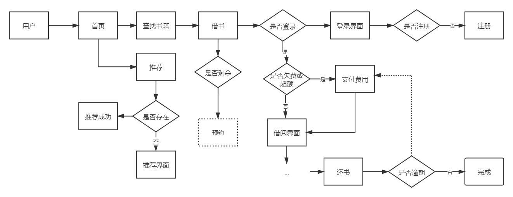

## 基于Springboot前后端分离的后端图书管理系统

### 介绍

#### 流程图

#### 技术栈
后端：

SpringBoot, Mybatis, Mysql...

前端：

...

#### 地址

首页：[http:127.0.0.1:8081](http://127.0.0.1:8081)

Api：[http://127.0.0.1:8081/swagger-ui](http://127.0.0.1:8081/swagger-ui)

### 进度
- 2021/4/20 修改了代码规范 修改了数据库
- 2021/4/19 修改了代码规范
- 2021/4/14 修复了授权认证
- 2021/4/13 整合了Shiro
- 2021/4/2 修改了数据库和其他规范 
- 2021/4/1 优化逻辑..
- 2021/4/1 更改前端方案  尝试FastApi + Jinjia2
- 2021/4/1 添加了利用Cookie的认证 完成基本逻辑
- 2021/3/31 修复异常 完善业务逻辑
- 2021/3/30 创建Vue
- 2021/3/30 整合Swagger 完善业务逻辑
- 2021/3/29 项目创建